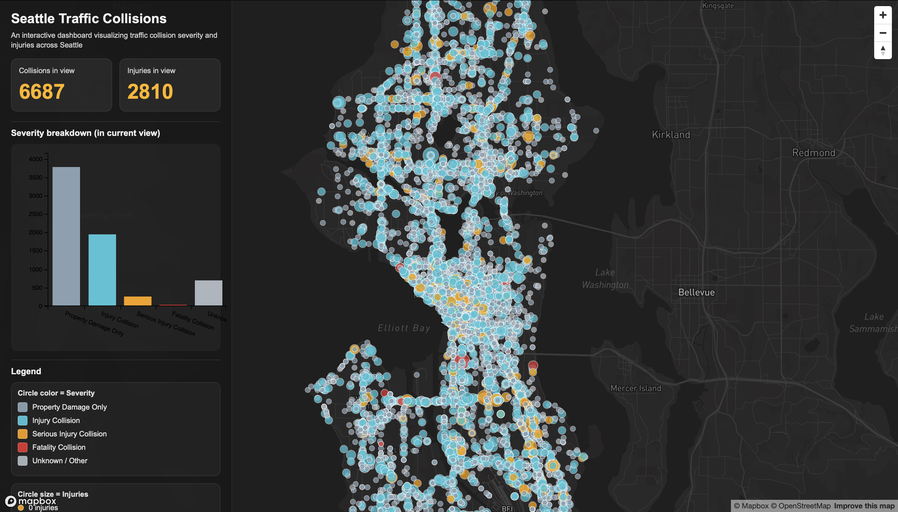
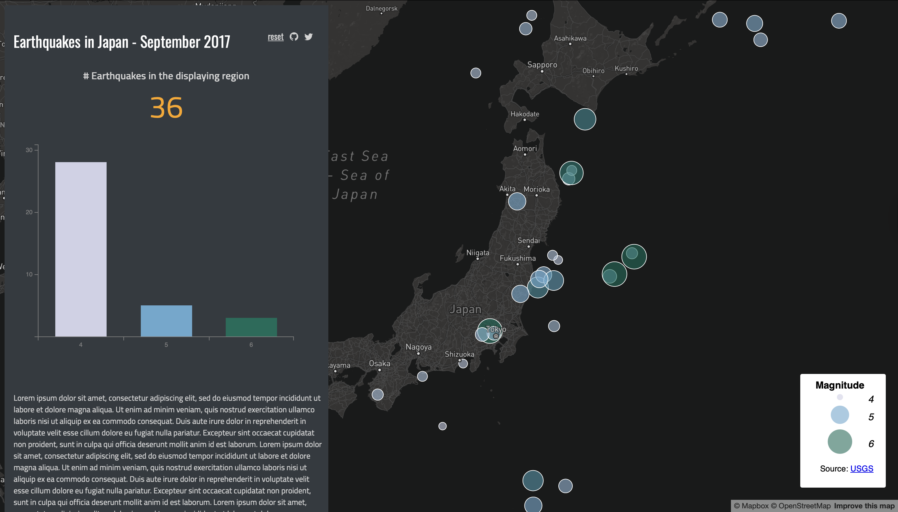

# Seattle Traffic Collisions Smart Dashboard

## Live Web Map
https://nalemu13.github.io/lab6-dashboard/

---

## Project Overview

This project is an interactive smart dashboard that visualizes traffic collisions across Seattle using an interactive Mapbox web map and dynamic charts. The dashboard allows users to explore where collisions occur and understand how collision severity varies across different areas of the city. The information panel dynamically updates based on the current map view, showing the number of collisions visible and a chart summarizing collision severity.

This dashboard demonstrates how geographic data, maps, and charts can be combined to create an interactive tool that helps users better understand spatial patterns and urban safety.

---

## Target Audience

This dashboard is designed for:

• Seattle residents  
• City planners  
• Transportation and safety officials  
• Researchers  
• Anyone interested in traffic safety patterns  

Users can explore collision patterns and identify areas with higher concentrations of incidents.

---

## Data Source

The primary dataset used in this project is:

**SDOT Collisions All Years**  
City of Seattle ArcGIS Online  
Source: Seattle GeoData  

This dataset contains:

• Geographic point locations of collisions  
• Collision severity descriptions  
• Collision attributes and metadata  

Dataset Link:  
https://data-seattlecitygis.opendata.arcgis.com/

The Mapbox basemap provides geographic context such as roads, neighborhoods, and city features.

---

## Map Type and Justification

This dashboard uses a **proportional symbol map** to represent traffic collisions.

This map type was chosen because:

• The data represents individual collision locations  
• Point symbols allow users to see exact collision positions  
• Symbol distribution helps reveal spatial patterns  
• It preserves geographic accuracy  

A choropleth map would aggregate collisions into larger areas, which would hide the precise locations of individual collisions.

---

## Dashboard Components

This dashboard includes multiple interactive components:

**Interactive Map**  
Displays collision locations using Mapbox proportional symbol mapping.

**Dynamic Collision Count**  
Shows the total number of collisions visible in the current map extent.

**Dynamic Bar Chart**  
Displays collision severity breakdown using C3.js. The chart updates automatically when the map view changes.

**Reset Button**  
Returns the dashboard to the default map view.

---

## Project Structure

Repository file structure:

lab6-dashboard/
  index.html
  readme.md
  css/
    style.css
  js/
    main.js
  data/
    collisions.geojson
  img/
    dashboard.png
    demo.png
    
---

## Screenshots

### My Dashboard

### Professor Demo Reference

---

## Conclusion

This smart dashboard demonstrates how interactive maps and charts can be combined to explore geographic data. By integrating Mapbox and C3.js, this project provides a tool that allows users to visualize and analyze traffic collision patterns across Seattle.

This approach makes spatial data more accessible, interactive, and easier to understand.
